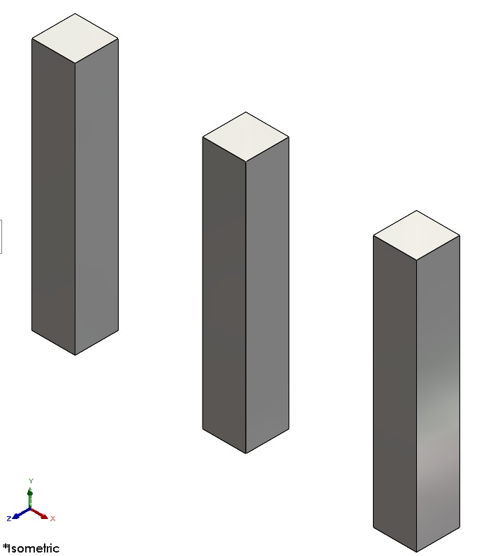
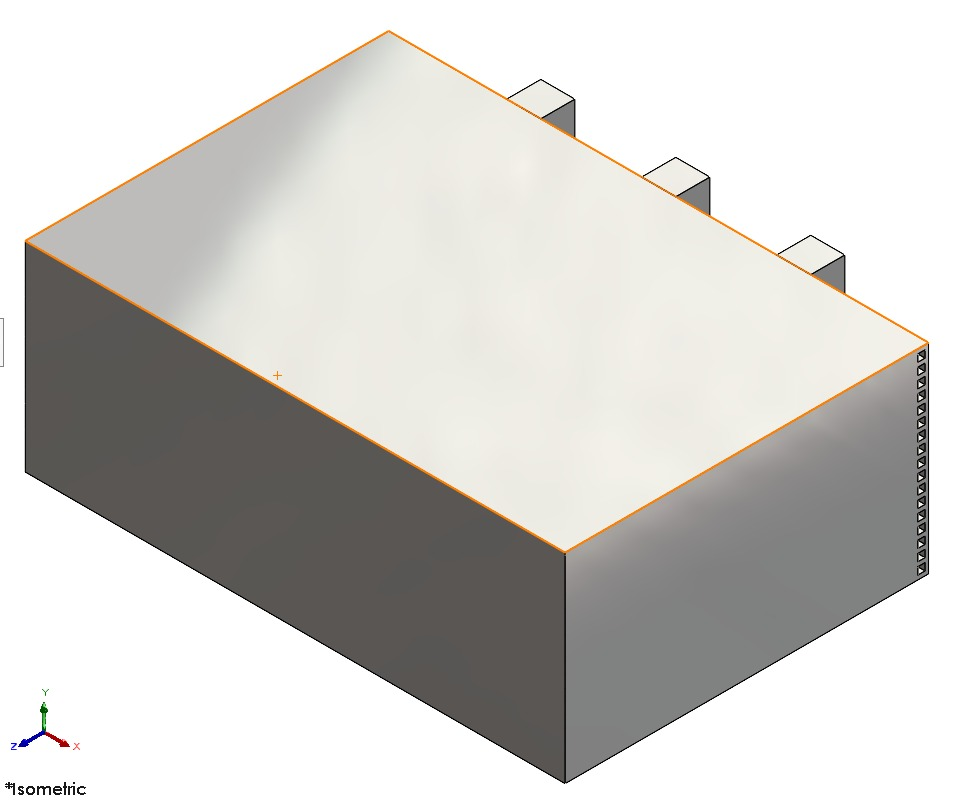
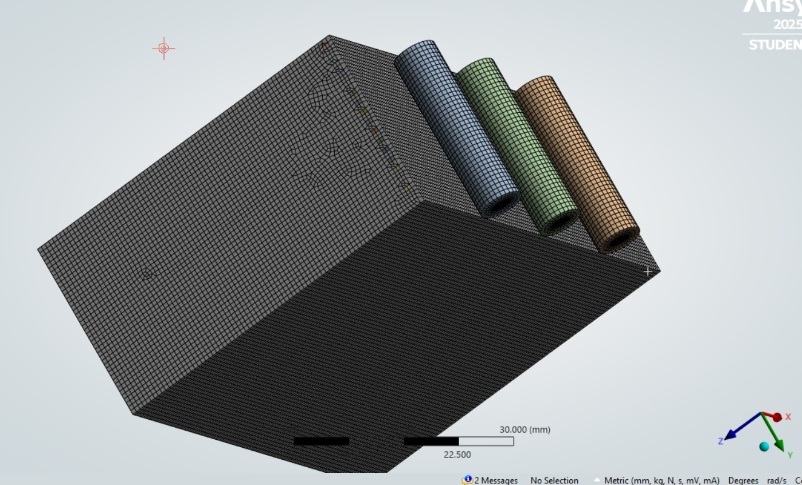
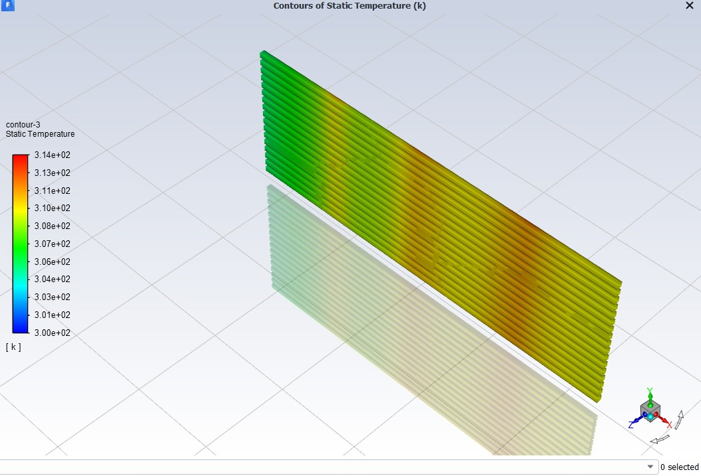
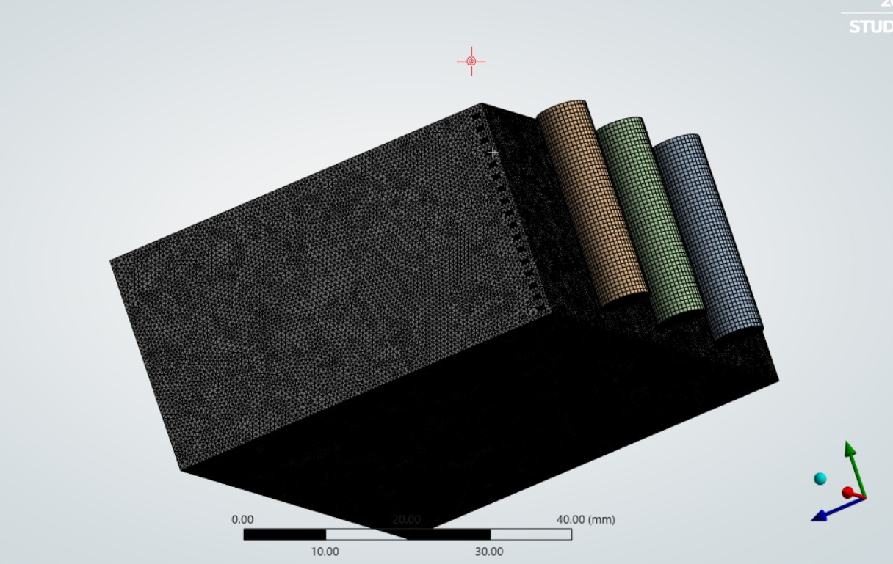
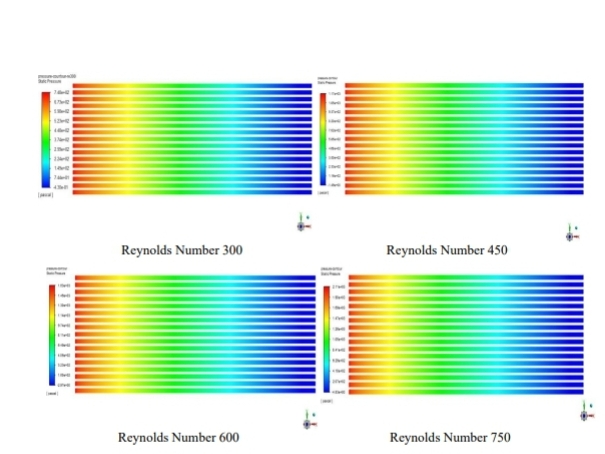
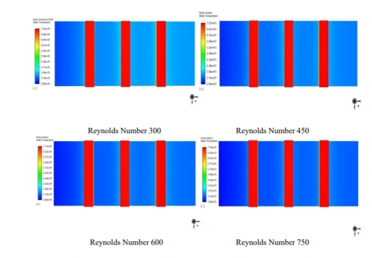

# Numerical-Investigation-of-Mini-Channel-Heat-Sink-for-Electronics-Cooling
In this project we have designed and analysed a Minichannel Heat Sink for Electronics Cooling using SOLIDWORKS and ANSYS Fluent. Performed CFD analysis to study heat transfer, temperature distribution, pressure drop, and thermal performance under different flow conditions for efficient electronic cooling applications.
We've also focused on optimizing thermal performance while maintaining acceptable hydraulic characteristics for compact cooling systems.
Overall the project demonstrates the application of computational fluid dynamics (CFD) in advanced thermal management and electronics cooling technologies.

